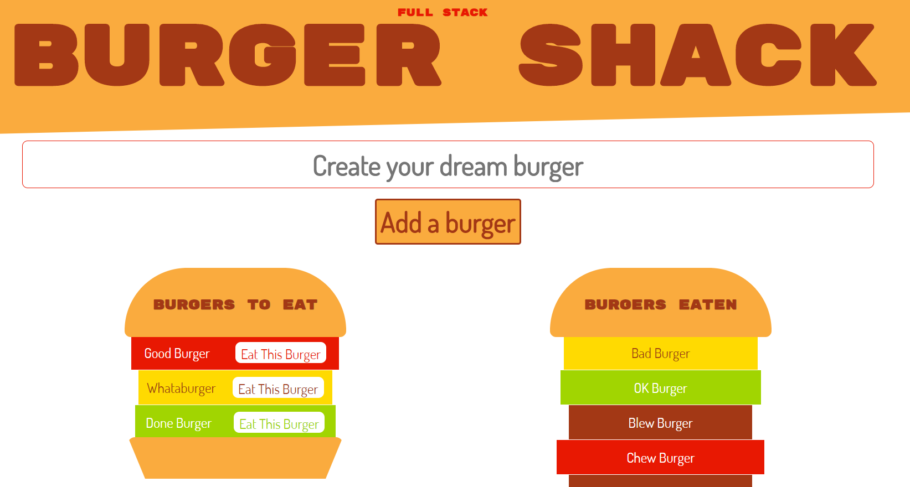

# Full Stack Burger Shack
Why make a to do app when you can make an app that allows you to name burgers and then eat them, moving them to an "eaten" container? 

## Description 
This full-stack app allows users to input information on the front end (name a burger) and send it to a back end, connecting to a cloud database using Sequelize as an ORM and an Express server launched from Node. The user can then see all database entries (view all burgers eaten and uneaten), including their own, printed back on the DOM. Further, they can change a value on any existing entry in the database (eat a burger) and thusly see that value moved to a different container on the dom (the eaten burger container...the stomach?)

Ultimately this is a very over-engineered way to change the DOM, but it is primarily an excercise in creating and modifying back end table entries in a database from the front end and pulling that information back to the front end. 

## Deployed App
Launched appication on Heroku: https://full-stack-burger-shack.herokuapp.com/

## Images
Screenshot of Full Stack Burger Shack
